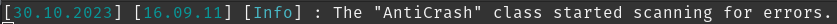

# Botun hata sırasında çökmesini engellemek

İlk önce bota paketi indirin.

- npm install utilscord

Botun ana dosyasının (index.js, bot.js gibi) en üstüne aşağıdaki kodu yazıp kaydedin ve botu yeniden başlatın.

```js
const { AntiCrash } = require("utilscord");
const antiCrash = new AntiCrash();
// Botunuzdaki iç hataları da göstermesini istiyorsanız sonraki yorumu kaldırın ve o satırı client tanımlamasından sonra kullanın.
// antiCrash.setClient(client);
antiCrash.init();
```

Şu şekilde bir çıktı alırsanız botu kullanmaya devam edebilirsiniz.


