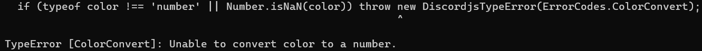

# Unable to convert color to a number hatası

Hata Örneği:



Hatayı alma sebebiniz:

- **.setColor(...)** fonksiyonunu kullanırken renk kodunu yanlış girmeniz.

Hatayı nasıl çözersiniz:

- Eğer rengi **ffffff** gibi giriyorsanız **#ffffff** gibi girin.
- Örnek:

```js
const embed = new EmbedBuilder().setDescription("Deneme").setColor("#ffffff");
```
