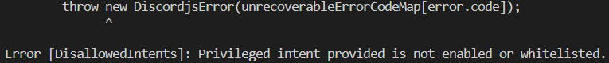
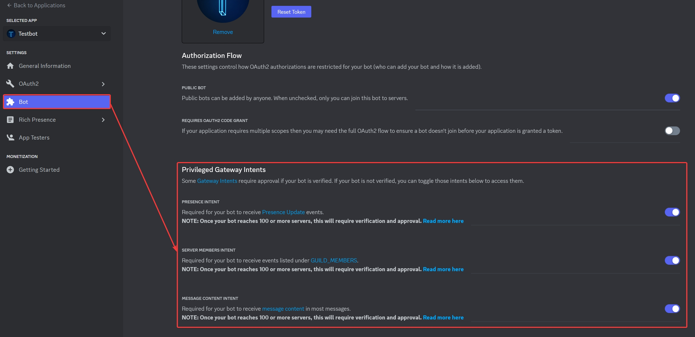

# DisallowedIntents (Used disallowed intents) hatası

Hata örneği:

Hatayı alma sebebiniz:

- Özel intentlerin (Priviliged intents) botunuzda açık olmaması.
- **Uyarı**: Eğer botunuz onaylanma aşamasında veya onaylıysa aşağıdaki çözümün sağlanması için istenilen intentlerin Discord'a başvurularak açtırılması gerekebilir.

Hatayı nasıl çözersiniz:

- [Discord Geliştirici Portalı](https://discord.com/developers/applications)'na gidin. Hesabınıza giriş yapmanız gerekebilir.
- Botunuzu seçip aşağıdaki görseldeki gibi **Bot** sekmesine gelin, **Privileged Gateway Intents** kısmındaki 3 seçeneği de açın ve botu yeniden başlatın.

