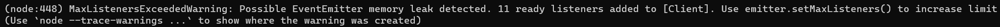

# MaxListenersExceededWarning hatası

Hata örneği:



Hatayı alma sebebiniz:

- Aynı isimli etkinlikten 10'dan fazla kullanırsanız olası bir kod hatasına karşı daha fazla etkinlik kaydedilmesini durdurur.

Hatayı nasıl çözersiniz:

- Aşağıdaki kodu client'i tanımladıktan hemen sonra kullanın:

```js
client.setMaxListeners(0);
```

- Örnek:

```js
// Kodun öncesi

const client = new Client({ intents: [] });
client.setMaxListeners(0);

// Kodun devamı
```
