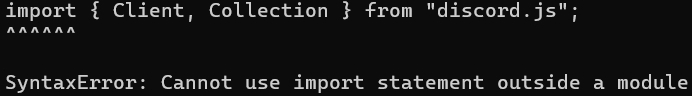

# Cannot use import statement hatası

Hata örneği:



Hatayı alma sebebiniz:

- JavaScript projelerinde (örneğin çalıştırmaya çalıştığınız bot) dosyaları projeye iki farklı şekilde içeri aktarabilirsiniz. Birincisi genellikle kullanılan **const ... = require("...")** ve ikincisi de daha yenilikçi **import ... from "...";** tarzıdır.

Hatayı nasıl çözersiniz:

- import'u kullanabilmek için package.json'a aşağıdaki kısmı ekleyin.

```json
"type": "module"
```

- Örnek package.json:

```json
{
  "name": "bot",
  "version": "1.0.0",
  "type": "module",
  "main": "./index.js",
  "scripts": {
    "start": "node ./index.js"
  },
  "license": "MIT",
  "dependencies": {
    "discord.js": "^14.14.1"
  },
  "engines": {
    "node": ">=16.x"
  }
}
```

- **Uyarı**: Normalde import ve require'yi aynı anda kullanamazsınız. Kullanmak için çözümü uyguladıktan sonra [buraya](./multipleRequires.md) bakınız.
