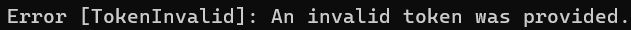
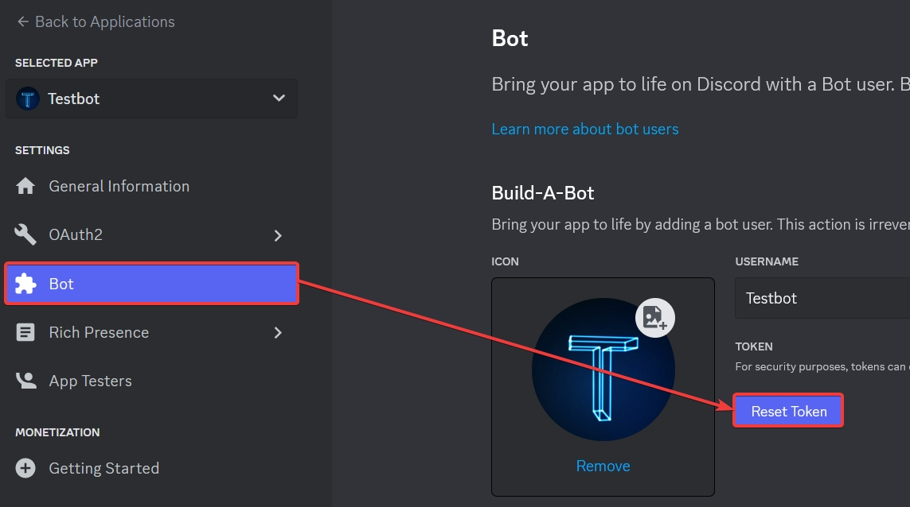

# TOKEN_INVALID veya TokenInvalid hatası

Hata örneği:

Hatayı alma sebebiniz:

- Tokeni aldığınız dosyada tokenin girdisi olmayabilir.
- Botunuzun eski tokenini kullanıyor olabilirsiniz.

Hatayı nasıl çözersiniz:

- [Discord Geliştirici Portalı](https://discord.com/developers/applications)'na gidin. Hesabınıza giriş yapmanız gerekebilir.
- Botunuzu seçip aşağıdaki görseldeki gibi **Bot** sekmesine gelin ve **Reset Token** butonuna tıklayıp çıkan tokeni kopyalayın.
- Elinizdeki tokeni kodunuzda gerekli yere yapıştırın ve kaydedip botu yeniden başlatın.

**Uyarı**: "SyntaxError: Unexpected token ..." hatası ile bu hatayı karıştırmayın. O hata için [buraya](./unexpectedToken.md) bakınız.
