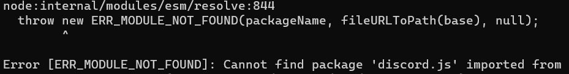
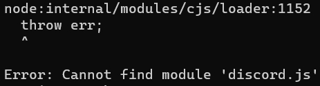

# Cannot find module/package 'x' hatası

Hata örnekleri:

Hatayı alma sebebiniz:

- Açıklamada x yerine yazan paketi yüklemediğinizden.

Hatayı nasıl çözersiniz:

- Kullandığınız paket yöneticisinden x yerinde yazan modülü yükleyiniz.
- **Örnek**: npm install discord.js
