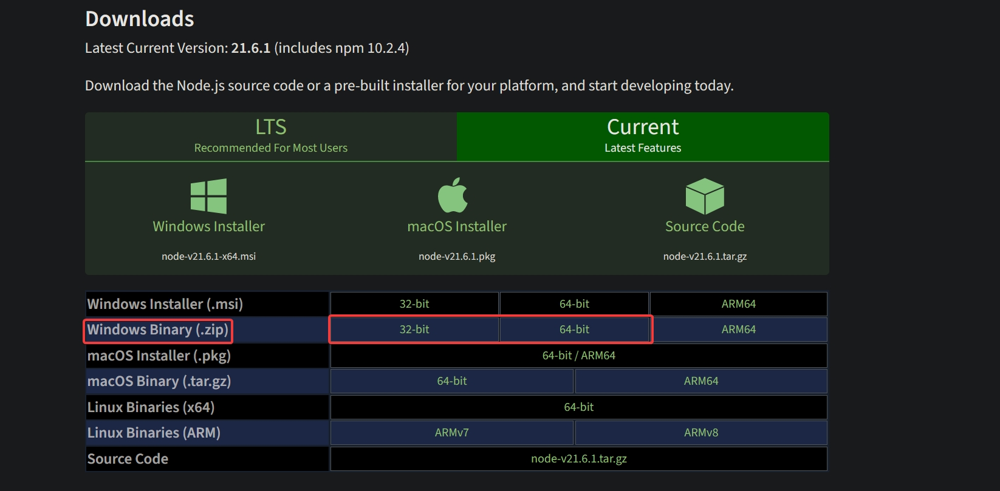

# Node.js'yi eski bir Windows sürümüne yüklemek

**Uyarı**: Node.js'nin yeni sürümlerinin eski işletim sistemlerinde çalışma garantisi **yoktur**.

- Eski Node.js sürümleri için [buraya](https://nodejs.org/en/about/previous-releases) gelip aşağıdan sürümünüzü bulup **Releases**'e tıklayın.
- Açılan pencereden **-win-x64.zip** (64 bit) veya **-win-x86.zip** (32 bit) ile biteni yükleyip ilk adımı atlayın.

- [Node.js](https://nodejs.org/en/download/current)'nin bilgisayarınıza uygun (32 veya 64 bit) sürümünü yüklüyoruz.

- İndirilen dosyayı WinRAR veya 7Zip gibi bir program ile ayıklayıp dosyanın içindeki her şeyi kopyalıyoruz.
- Windows'un yüklü olduğu diskin içine **node32** adında bir klasör oluşturup kopyaladığımız dosyaları içine atıyoruz.
- Klasörün yolunu kopyalıyoruz.
  - Örnek: **C:\node32**
- İstenilen menüye iki şekilde ulaşabiliriz:
  1. Masaüstüne veya dosya yöneticisine gelip **Bilgisayar**'a sağ tıklayıp **Özellikler**'e basıyoruz, sol taraftaki seçeneklerden en alttaki olan **Gelişmiş Sistem Ayarları**'na tıklıyoruz.
  2. Arama çubuğuna **Ortam değişkenleri** yazıp çıkan **Sistem ortam değişkenlerini düzenle** sonucunu açıyoruz.
- Alt tarafta kalan **Ortam Değişkenleri** seçeneğine tıklıyoruz.
- Açılacak sekmede **Path** seçeneğini seçip **Düzenle** diyoruz ve kopyaladığımız dosya konumunu değerin başına yapıştırıp sonuna **;** ekliyoruz.
  - Örnek: **C:\node32;**%JAVA_HOME%\bin;...
- Tamam deyip kapattıktan sonra aşağı taraftaki sistem değişkenlerinin altındaki **Yeni** seçeneğine tıklıyoruz. Çıkan sekmede değişken adını **NODE_PATH** ve değerini **(node32 klasörü)\node_modules** olarak giriyoruz.
  - Örnek: **C:\node32\node_modules**
- Ardından tekrar sistem değişkenlerinin altındaki **Yeni** seçeneğine basıp değişken adını **NODE_SKIP_PLATFORM_CHECK** ve değerini **1** olarak giriyoruz.
- Her şeyi **Uygula** (varsa) ve **Tamam** seçeneğine tıklayarak kapatıyoruz.
