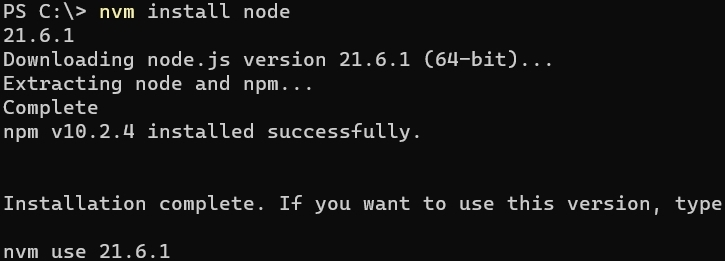

# Node sürümünü nasıl yükseltirim?

Node sürümünüzü nasıl yükselteceğiniz botu çalıştırdığınız platforma göre değişir. Kullandığınız ortama göre nasıl yapacağınıza aşağıdan ulaşabilirsiniz.

Windows - 2 yoldan kurabilirsiniz:

1. - [Node.js](https://nodejs.org) sitesinden en son (Current) veya uzun süreli destek (LTS) sürümünü yükleyip kurunuz.
   - Kurulumdan önce **Build Tools** sekmesindeki tiki işaretlemeniz bazı altyapılarda modül kurulum sırasındaki hataları engelleyebilir. ([Daha detaylı bilgi](./buildTools.md))
2. - [NVM](https://github.com/coreybutler/nvm-windows/releases) programının en son sürümünü indirip kurun.
   - Yeni bir komut satırı açın ve **nvm install node** yazın.
   - Çıktıda **nvm use** ile başlayan komutu komut satırına yazın ve Node.js kullanıma hazırdır.
   - **Not**: Bu şekilde en son Node.js sürümünü kurmuş olursunuz. Eğer farklı bir sürüm kurmak istiyorsanız sırayla **nvm install sürüm** ve **nvm use sürüm** yapmalısınız.

   

Glitch:

- **Uyarı**: Glitch varsayılan olarak Node.js 12 sürümüyle gelir, şu an en son Node.js 16.14.2 sürümünü destekliyor ve bazı yeni altyapılar Node.js 18 ve üstü sürümler gereksinim duyulduğu için Glitch kullanmanız bazı hatalara sebep olabilir. (26.01.2024 tarihinde kontrol edildi.)
- package.json dosyasını açıp içine aşağıdakini ekleyin. **Eklenecek yerden önceki satırın sonuna örnekteki gibi virgül koymayı unutmayın!**

```json
"engines": {
  "node": ">=16.x"
}
```

- Örnek package.json:

```json
{
  "name": "bot",
  "version": "1.0.0",
  "type": "module",
  "main": "./index.js",
  "scripts": {
    "start": "node ./index.js"
  },
  "license": "MIT",
  "dependencies": {
    "discord.js": "^14.14.1"
  },
  "engines": {
    "node": ">=16.x"
  }
}
```
