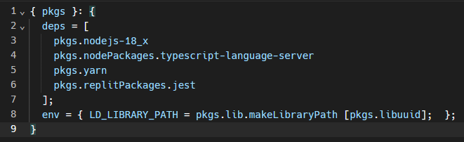

# libuuid.so.1: cannot open shared object file: No such file or directory hatası

Hatayı alma sebebiniz:

- Replit'te Canvas gibi bir modülü yüklemeye çalışırken bir paketin eksikliği yüzünden hata alırsınız.

Hatayı nasıl çözersiniz:

- Dosyalar kısmındaki üç noktaya tıklayıp **Show hidden files** tuşuna tıklayın.
- Dosyalar kısmında aşağıda gözükecek **replit.nix** dosyasını açın.
- **];** satırından sonraki satıra alttaki yazıyı örnekteki gibi yapıştırın.

```nix
env = { LD_LIBRARY_PATH = pkgs.lib.makeLibraryPath [pkgs.libuuid]; };
```

- Dosyayı kaydedin ve sayfayı yenileyin.
- Örnek:


