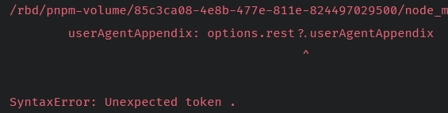
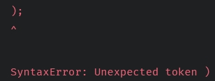

# UnexpectedToken hatası

Bu duruma sebep olabilen iki farklı hata vardır:

---

Hata örneği 1: Hata kaynağı discord.js'den geliyor.

- Genellikle hatayı gösteren ok soru işaretinden sonraki noktayı gösterir: **?.**

Hatayı alma sebebiniz:

- Node.js sürümünüzün eski olması.

Hatayı nasıl çözersiniz:

- [Buraya](./nodeVersionUpgrade.md) bakınız.

---

Hata örneği 2: Hata kaynağı botun içindeki bir dosyadan geliyor.

- Genellikle hatayı gösteren ok bir parantezi gösterir: **);**

Hatayı alma sebebiniz:

- Kodunuzdaki bir yazım yanlışı.

Hatayı nasıl çözersiniz:

- VSC (Visual Studio Code) gibi bir program ile kodlama yaparken araç size hatanızı gösterecektir.
- Hatayı hâlâ çözemiyorsanız [sunucumuzdan](https://discord.gg/altyapilar) yardım isteyebilirsiniz.
